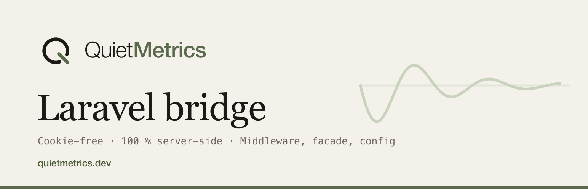

# quiet-metrics/laravel-metrics



> 🇫🇷 [Version française](README.fr.md)

Laravel bridge for [Quiet Metrics](https://quietmetrics.dev) (La Boîte à Code): automatic server-side pageviews via middleware, a facade for events, publishable configuration. Tracking is 100% server-side and JS-free, with no identification or tracking cookies, invisible to ad blockers. Built on the [core PHP package](https://github.com/Quiet-Metrics/php-metrics) (`quiet-metrics/php-metrics`).

Compatible with Laravel 10 to 13 (illuminate/support ^10 || ^11 || ^12 || ^13), PHP >= 8.1.

## Installation

```bash
composer require quiet-metrics/laravel-metrics
```

The service provider and the facade alias are registered automatically (package discovery).

## Configuration

Publish the configuration file (optional; environment variables are enough in most cases):

```bash
php artisan vendor:publish --tag=quiet-metrics-config
```

Environment variables:

```dotenv
# Site keys, from the "Installation" panel of the Quiet Metrics dashboard.
QUIET_METRICS_PUBLIC_KEY=qm_pub_xxxx
# ESSENTIAL for server-side sending: enables signed mode (HMAC), the only
# case where the visitor IP/UA carried by your server are trusted. Without
# it, every hit would carry your server's IP: a single visitor counted.
QUIET_METRICS_SECRET_KEY=qm_sec_xxxx

# Optional:
QUIET_METRICS_ENDPOINT=https://quietmetrics.dev/api/v1/collect
QUIET_METRICS_TRUST_PROXY=false   # true if the app sits behind a reverse proxy / CDN
```

## Usage

### Middleware: automatic pageviews

The middleware is registered under the `quiet-metrics` alias. Per route or per group:

```php
Route::middleware('quiet-metrics')->group(function () {
    // ... your web routes
});
```

Globally on the whole web group, Laravel 11+ (`bootstrap/app.php`):

```php
use QuietMetrics\Laravel\Middleware\TrackPageview;

->withMiddleware(function (Middleware $middleware) {
    $middleware->web(append: TrackPageview::class);
})
```

Laravel 10 (`app/Http/Kernel.php`):

```php
protected $middlewareGroups = [
    'web' => [
        // ...
        \QuietMetrics\Laravel\Middleware\TrackPageview::class,
    ],
];
```

The middleware only counts successful HTML `GET`s: non-GET requests, non-2xx responses and AJAX/JSON requests are ignored.

### Facade: custom events

```php
use QuietMetrics\Laravel\Facades\QuietMetrics;

// Event with properties (scalar values, 30 keys max).
QuietMetrics::event('signup', ['plan' => 'pro']);

// Manual pageview, overridable context (useful outside HTTP requests:
// jobs, artisan commands; `url` is then required).
QuietMetrics::pageview(['url' => 'https://mysite.com/pricing']);
```

You can also inject `QuietMetrics\Client` directly (registered as a singleton) instead of going through the facade.

## Opting out of measurement

A visitor can ask to stop being counted, with no account and without writing to anyone: they visit a page of your site with `?qm_ignore=1`, and `?qm_ignore=0` puts them back into measurement.

```
https://mysite.com/?qm_ignore=1     stop being counted
https://mysite.com/?qm_ignore=0     be counted again
```

The marker is a **first-party cookie of your own site**, named `qm_ignore` with the value `1` (`path=/`, `samesite=lax`, `secure` over https, five years). The `quiet-metrics` middleware takes care of it: it stores or clears the marker on the response, and sends nothing while it is there. Nothing to wire.

It holds no identifier (its value is the same for everyone), it is never transmitted to Quiet Metrics, and it exists only to stop measurement: it is an opt-out marker, not a tracker. The JS tracker additionally writes the same value to `localStorage`, but a server-side SDK only ever reads the cookie: one visit therefore covers both tracking modes.

## How it works

The provider builds a `Client` singleton (core package) from the `quiet-metrics` config. The middleware sends the pageview in `terminate()`, after the response has been sent to the visitor: no impact on perceived latency. The context (URL, referrer, IP, User-Agent, language) comes from the `Request` object, never from superglobals: correct under Octane and persistent workers, in tests, and aligned with the host application's trusted proxies. On the core side, sending is non-blocking (fire-and-forget socket, short cURL fallback) and every failure is silent: analytics never breaks the site.

## Tests

```bash
composer update && composer test
```

Orchestra Testbench suite against the core package's HTTP capture server: signed middleware pageview (HMAC verified), exclusions (JSON, POST, errors), `event` facade, configured singleton.

## License

MIT. A [La Boîte à Code](https://laboiteacode.fr) product for [Quiet Metrics](https://quietmetrics.dev).
